<a href="https://github.com/GarvitSharma20">
  <picture>
    <source media="(prefers-color-scheme: dark)" srcset="./dark_mode.svg">
    <source media="(prefers-color-scheme: light)" srcset="./light_mode.svg">
    
  </picture>
</a>

## About

4th-year B.Tech CSIT student at AKGEC, Ghaziabad. I build embedded systems (ESP32, Arduino, IoT) and ship AI-powered apps (Flutter, Firebase, TypeScript, Python).

## Projects

| Project | What it is | Link |
|---|---|---|
| **Vasuki** | Autonomous snake-like disaster-response robot with live video, audio and gas detection (patent filed) | [repo](https://github.com/GarvitSharma20/REPLACE_WITH_REPO_NAME) |
| **Pavitra Step** | IoT wearable health-monitoring system for defense use (patent filed) | [repo](https://github.com/GarvitSharma20/REPLACE_WITH_REPO_NAME) |
| **ai-interview** | Multi-turn adaptive AI technical interviewer, built for a hackathon | [repo](https://github.com/GarvitSharma20/ai-interview) |
| **Field monitoring robot** | ESP32-based army field monitoring robot (4th-year major project) | [repo](https://github.com/GarvitSharma20/REPLACE_WITH_REPO_NAME) |

> Browse everything: [all repositories](https://github.com/GarvitSharma20?tab=repositories)

## Stack

## Connect

